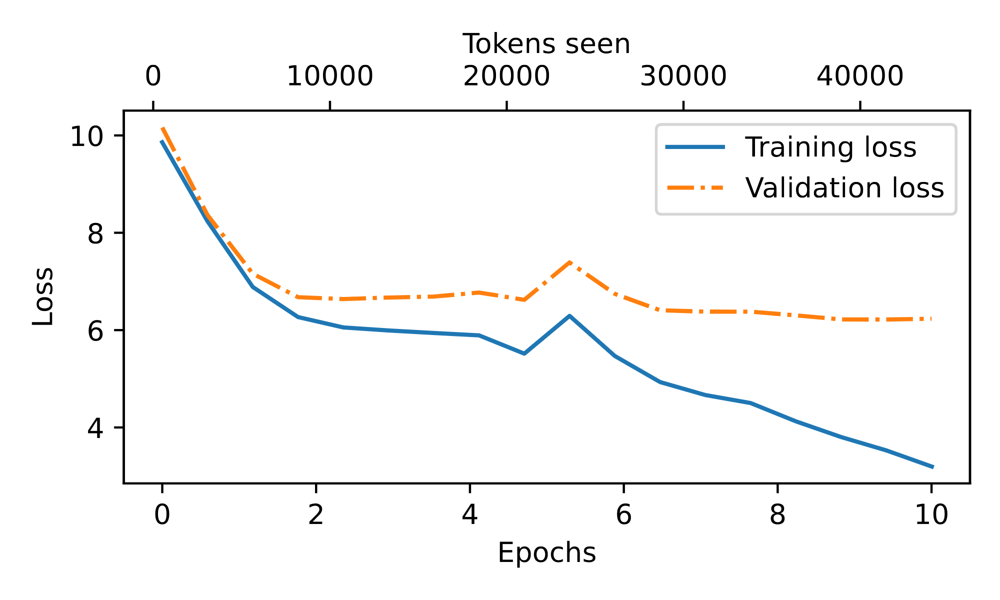

# LLM-from-Scratch

This project is a **from-scratch implementation of a GPT-2–style language model**.  
The goal is to understand every internal component — from the tokenizer to the transformer architecture — while maintaining practical performance with techniques like **top-k sampling** and **temperature scaling**.

---

## Features

- **Byte-Pair Encoding (BPE) tokenizer** implemented from scratch  
  - Based on GPT-2’s original tokenizer (`vocab_size = 50257`).  
  - Efficiently splits raw text into subword units, balancing vocabulary size and sequence length.  
  - Learns frequent byte-pair merges to handle rare or unseen words without falling back to character-level models.

- **Transformer model built from first principles**  
  - **Multi-Head Self-Attention:**  
    - Splits the embedding space into `n_heads = 12` attention heads.  
    - Each head independently computes attention, then results are concatenated for richer contextual understanding.  
  - **Transformer Block:**  
    - LayerNorm → Multi-Head Self Attention → Dropout → Residual Connection  
    - LayerNorm → Feed Forward Network (2 linear layers + GELU) → Dropout → Residual Connection  
    - Repeat for `n_layers = 12`.

- **Sampling strategies for better text generation**  
  - **Top-k Sampling:** Restricts next-token choices to the top *k* most probable tokens, preventing nonsensical completions.  
  - **Temperature Scaling:** Controls the "creativity" of the model by adjusting the logits distribution before sampling.

---

## Model Hyperparameters

The model is configured to roughly match GPT-2 small (124M parameters):  

```python
GPT_CONFIG_124M = {
    "vocab_size" : 50257,
    "emb_dim"    : 768,
    "context_len": 256,
    "n_heads"    : 12,
    "n_layers"   : 12,
    "drop_rate"  : 0.5,
    "qkv_bias"   : False
}
```

<h2>Training Progress</h2>
<p>The following graph shows how the loss decreases over training epochs:</p>


